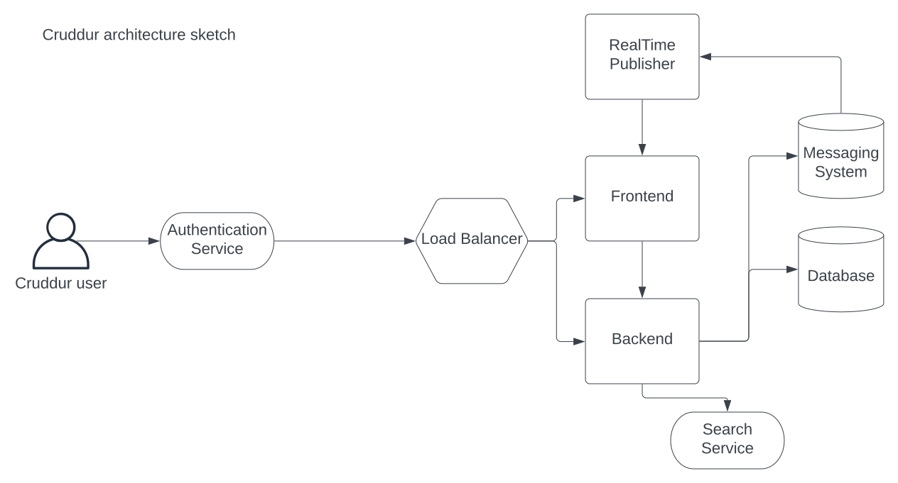
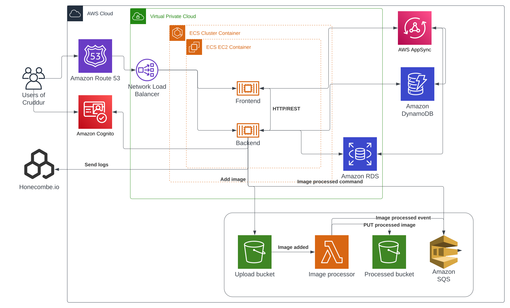

# Week 0 — Billing and Architecture

_Marcus Holmgren - 2023-02-19_

To build the messaging platform I propose that the messaging platform is built as a SaaS (Software as a Service) product.

## Technology stack
Frontend: React
Backend: Python Flask

AWS architecture:
- Fargate for both frontend and backend
- S3 for static files
- Lambda image processing
- <strike>CloudWatch for logging</strike>. [honeycomb.io](https://www.honeycomb.io) will be used instead
- Route53 for DNS
- Certificate Manager for SSL
- AWS Aurora for database
- AWS DynamoDB for time limited messages
- AWS Cognito for authentication
- Virtual Private Cloud (VPC) for security
- Load Balancer

We expect to be able to handle 1000 concurrent users with the proposed architecture.
Since we are a startup we must be cost conscious and also be able to onboard new team members quickly when we scale up operations.
If we learn of better technologies that suit or needs and are cost effective we will switch to them.

